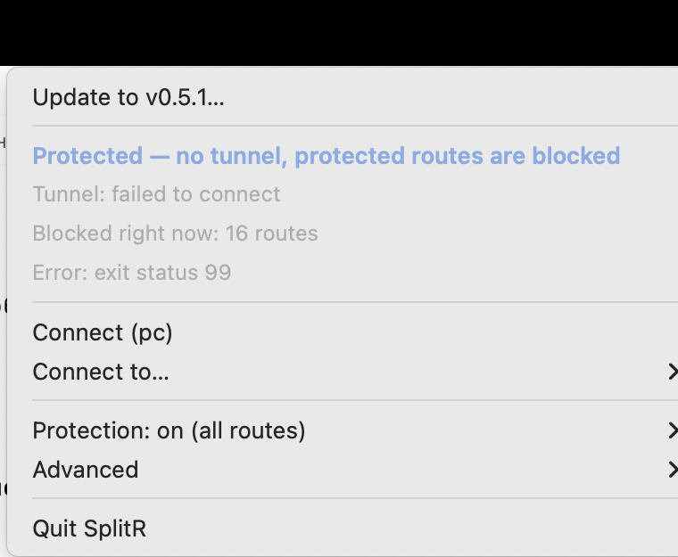

# SplitR

An sshuttle tunnel manager for macOS with pf-based route protection.

The problem it solves: when the tunnel is not up, whether it crashed, you
turned it off, or it has not started yet, traffic to the protected routes must
not leave the machine at all. Not over the home connection, not over any VPN.


The recording above is scripted in `.vhs/demo.tape`; `vhs .vhs/demo.tape`
regenerates it.

## How it works

On macOS, sshuttle intercepts traffic through pf. In its own anchor,
`sshuttle-<port>`, appended to the end of the main ruleset, it keeps roughly
this:

```
rdr pass on lo0 inet proto tcp from ! 127.0.0.1 to 10.0.0.0/9 -> 127.0.0.1 port 12300
pass out route-to lo0 inet proto tcp to 10.0.0.0/9 keep state
```

In pf, without the `quick` keyword the last matching rule wins. SplitR builds
on that directly. Its anchor sits before sshuttle's:

```
table <splitr_block> persist { ...protected routes... }
table <splitr_pass>  persist { ...exceptions... }
block drop out on ! lo0 inet from any to <splitr_block>
pass  out on ! lo0 inet from any to <splitr_pass>
```

With the tunnel up, sshuttle's `pass out route-to lo0` sits lower and overrides
the block, so SplitR stays out of the way. With no tunnel there is no sshuttle
anchor, nothing overrides the block, and the packet dies on its way out of the
interface.

That is why the rules stay loaded at all times. There is no window where the
tunnel is already gone but protection has not kicked in yet. The daemon is not
being fast here; the design simply has no such window.

The `on ! lo0` restriction is essential: sshuttle redirects traffic onto lo0,
and blocking there would tear down the tunnel itself.

The rules live in `/etc/pf.anchors/splitr` and load when `/etc/pf.conf` is
parsed, so they survive a reboot with no daemon involved. The daemon, in turn,
does not release its pf reference when it stops, because otherwise restarting
the service would drop protection for a few seconds.

## What the daemon does

The watchdog repairs protection when something breaks it. It reloads the anchor
rules after a foreign `pfctl -F all`, links the anchor back into the main
ruleset, and re-enables pf if it was turned off. It also removes sshuttle
anchors left behind by a tunnel killed with SIGKILL. Real pf does not delete an
anchor node after flushing it, and one such empty shell once convinced the
daemon the tunnel was alive forever, which meant it stopped repairing anything.

It reacts to events, not only to a timer. A subscription to the `AF_ROUTE`
socket reports network changes immediately, and wake-from-sleep is inferred
from a jump in wall-clock time (there is no event-based way to detect it on
Darwin without cgo; Tailscale's netmon works the same way). The ticker remains
as a backstop. After a wake the daemon resets its reconnect backoff and kills
pf states if the tunnel is down, since a connection opened on the previous
network would otherwise survive the sleep and bypass protection.

Switching to `strict` kills states too. Without that, the promise to cut the
protected routes immediately was not kept: pf lets a packet through on a state
table entry without consulting the rules again, so established connections kept
working.

## Related tools

Both halves of this exist separately and are worth knowing about.

[sshoot](https://github.com/albertodonato/sshoot) manages sshuttle profiles
from the command line, which it has done well since 2017. It does not concern
itself with what happens to your traffic when the tunnel is not running.

[vpn-kill-switch/killswitch](https://github.com/vpn-kill-switch/killswitch) is a
mature macOS kill switch built on pf, and if you use a normal VPN you probably
want it rather than this. It detects the tunnel by looking at the routing table
and `utun` interfaces, which is the right approach for WireGuard or IPSec and
the wrong one for sshuttle, since sshuttle creates neither. It is also enabled
and disabled by hand, so the protection is only there when you remember to turn
it on.

[no-YOU-talk-to-the-hand](https://github.com/flashashen/no-YOU-talk-to-the-hand)
orchestrated sshuttle tunnels from YAML with health checks, which is close in
spirit, but it has not been touched since 2019 and has no leak protection
either.

What none of them do is keep a fail-closed rule loaded for sshuttle
specifically, which is the only thing SplitR adds to the pile. Everything else
here has been done before.

## Install

```bash
brew install tasticolly/splitr/splitr
sudo splitr install
```

`splitr install` is the part that needs root: it writes the config, adds the
anchor call to `/etc/pf.conf` and starts the daemon. The menu bar app is not in
the tap yet, since that needs notarization; build it from a checkout with `make
menubar`.

From source instead, which is also how you get the menu bar app (needs Go
1.26+ and sshuttle):

```bash
git clone https://github.com/tasticolly/splitr.git
cd splitr
make update
```

`make update` is the one command for both the first install and every update
afterwards: format and vet checks, unit tests, build, the menu bar app, the
daemon, and `doctor` at the end. If the tests fail, nothing gets installed.

What the install does:

1. puts the binary in `/usr/local/bin/splitr`;
2. creates `/usr/local/etc/splitr/config.yaml` if it is missing;
3. appends an anchor call for `splitr` to `/etc/pf.conf`, keeping a dated copy
   of the original next to it;
4. installs and starts the `com.splitr.daemon` LaunchDaemon, waiting until it
   brings up its control socket.

Remove everything: `make uninstall`.

`splitr doctor` checks the whole installation: binary, config, the pf.conf
patch, the anchor file, the service, profile ssh keys, whether the daemon is
alive, the state of pf. For every failed check it prints the command that fixes
it.

## Versions

```bash
make version                              # what is built and what is installed
make release V=v0.3.0 M='what changed'    # run checks and tag
make rollback V=v0.2.0                    # build and install an older tag
```

`release` refuses to run on a dirty tree: a tag on uncommitted code cannot be
reproduced. `rollback` builds the requested tag in a separate git worktree, so
uncommitted work stays where it is; `make update` brings you back.

## Control

Everything is available from the menu bar; the CLI and the web interface are
the same operations by other means.

### Menu bar



The icon shows the state without opening the menu. Shape and colour tell
"protected", "no tunnel, routes are dropped", "strict", "protection off" and
"daemon unreachable" apart, and the top line of the menu answers the same
question in words.

The primary action is contextual: `Connect` with a profile submenu when the
tunnel is down, `Disconnect` when it is up. Items that would do nothing in the
current state are greyed out rather than hidden, so the menu never jumps, and
each one explains why. Things you reach for rarely live under `Advanced`: pf
rules, logs, the config editor, the live stream of dropped packets, the web
interface.

### Web interface

<http://127.0.0.1:8787>, or `splitr ui`.

The listener checks the `Host`, `Origin` and `Sec-Fetch-Site` headers. Without
that, any page open in a browser could turn protection off with a single
`fetch(..., {mode: 'no-cors'})`, and DNS rebinding could read the config with
its key paths and host names. Non-browser clients do not send those headers and
work as before.

Editing the config from the browser is deliberately refused with a 403. The
config names the sshuttle binary that the daemon runs as root, so the ability to
rewrite it over TCP would be a way for any local process to become root. Writes
are only accepted over the control socket, which is what `splitr config edit`
and the menu bar use.

### CLI

```bash
splitr status                 # what is going on
splitr up pc                  # bring the tunnel up through profile pc
splitr down                   # take it down (protection stays!)
splitr protect off            # drop protection; restore with: splitr protect on
splitr protect strict         # cut protected routes unconditionally, tunnel or not
splitr protect public         # switch the policy on the fly
splitr probe                  # verify that traffic really does not leave
splitr blocked                # live stream of dropped packets
splitr rules                  # print the current pf rules
splitr config edit            # edit the config in $EDITOR, no sudo
splitr log --tail 100         # tail of the daemon log
splitr doctor                 # check the whole installation
```

The CLI talks to the daemon over `/var/run/splitr.sock` (group `staff`), so
day-to-day commands need no `sudo`.

`probe` does more than poke a protected address. It first checks a control
address outside the protected set, because on its own "address unreachable"
means nothing: it could be protection working or simply no internet.

## Configuration

`/usr/local/etc/splitr/config.yaml`; the annotated template is
`config.example.yaml`. The essentials:

* `subnets`: routes pushed through the tunnel (the same list sshuttle takes);
* `excludes`: never routed and never protected (the home LAN);
* `protection.mode`:
  * `all` protects every route in `subnets`. Strongest, but without a tunnel
    the private 10/172.16/192.168 ranges are unreachable too. See the warning
    below;
  * `public` protects only the public ranges, where the source address is
    visible to the far side. Local networks keep working;
  * `custom` protects exactly `protection.block`;
  * `off` protects nothing;
* `protection.allow`: exceptions on top of everything else;
* `protection.log`: write dropped packets to `pflog0` so that `splitr blocked`
  and the live stream in the UI work;
* `daemon.log_max_bytes` and `daemon.log_keep`: log rotation. The daemon runs
  as root for months and launchd does not watch the file size;
* `profiles`: one per exit host. A profile takes either `dns: true`, which
  sends every lookup through the tunnel, or `dns_servers`, which sends only the
  lookups addressed to the resolvers you name there. The second is usually what
  you want: with all DNS tunnelled, any public name the far side declines to
  resolve stops working locally as well. Point macOS at those resolvers for the
  internal domains with files in `/etc/resolver`, and the rest of DNS keeps
  resolving directly.

After editing: `splitr reload`. To check without applying anything,
`splitr validate <file>` prints the pf rules it would generate.

## Things worth knowing

`mode: all` protects the private ranges too. The list includes `10.0.0.0/9` and
`192.168.0.0/16`. At home that is harmless, since `192.168.1.0/24` is in the
exceptions. But on a hotel or café network addressed `10.x` or `192.168.0.x`,
the whole internet goes down without a tunnel. If that is inconvenient, use
`mode: public`.

Ping and UDP to the protected routes stop working even with the tunnel up.
sshuttle proxies TCP only (plus DNS); everything else always went out directly,
which is exactly the traffic that was escaping. Now it is dropped.

Other VPNs are unaffected, because protection only matches the destinations
listed in the config. Watch out for one thing: tunnel interfaces of other
clients often live inside `172.16/12` or `10/8`, that is, inside the protected
ranges. If such a client also hands the system a DNS server on that subnet,
name resolution stops working entirely. The fix is one line in
`protection.allow`.

Tunnel throughput has a ceiling. sshuttle limits in-flight data to keep one
transfer from starving the rest of the tunnel, and the default 32 KB works out
to about 5 Mbit/s at a 50 ms round-trip, shared by everything routed through it.
A screen share can saturate that alone, which shows up as a video call that
stutters while audio stays perfect. `sshuttle.extra_args` raises the limit; the
shipped default is 256 KB. To find your own ceiling, measure the round-trip
with `curl -sk -o /dev/null -w '%{time_appconnect}\n' https://<host>/` through
the tunnel and divide the buffer by it.

IPv4 only. Every listed route is IPv4.

The control socket is writable by group `staff`, and the daemon reads the config
as root. On a single-user laptop that is a deliberate trade for convenience:
whoever can write to the socket can run `sudo` anyway.

## Tests

Three levels, because one level cannot cover this.

```bash
make test          # unit: no root, no network, no changes to the system
make docker-test   # e2e: real sshd and sshuttle, pfctl replaced with a stub
sudo make test-pf  # native pf: the kernel's actual packet decisions
```

`make docker-test` brings up three containers: a client, an intermediate host
with sshd, and a target reachable only from the network behind that host. It
exercises the whole product end to end, from the tunnel manager and the
watchdog to the API, the CLI and the state machine. What it deliberately does
not cover is the kernel's pf decisions. Linux has no pf, `pfctl` there is a
stub, and testing `quick` and last-match-wins semantics on it would be a lie.

`sudo make test-pf` closes exactly that gap on a real macOS kernel. It loads the
rules into pf and checks that a connection to a protected address is severed,
that an anchor imitating sshuttle overrides the block, and that `strict` is
overridden by nothing. The test snapshots and restores pf state around itself.

Details are in `test/docker/README.md` and `test/pfe2e/README.md`.
